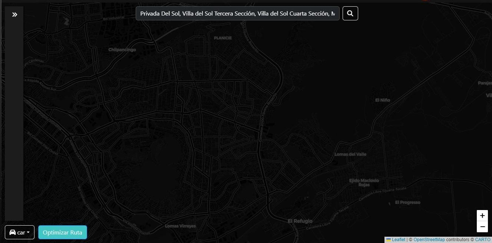
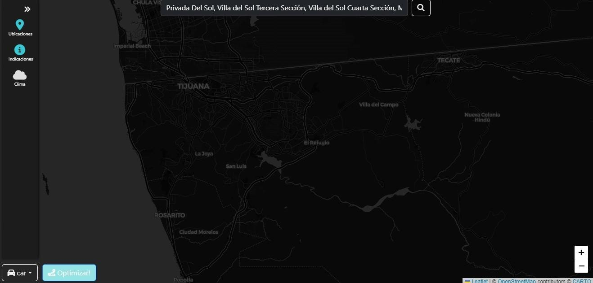

# **Aplicación de Optimización de Rutas**

Esta es una **aplicación web** diseñada para ayudar a los usuarios a encontrar rutas optimizadas entre destinos, ya sea para viajar en **auto**, **a pie** o **en bicicleta**. La aplicación ofrece indicaciones y destalles como el clima.

La aplicación está construida con **HTML**, **JavaScript**, **CSS**, **Bootstrap**, y usa **Leaflet** para mostrar mapas interactivos. Además, integra diversas APIs para obtener información relevante como direcciones, puntos de interés cercanos y más.

---

## 🌟 **Características Principales**
- **Optimización de Rutas**: Los usuarios pueden obtener rutas optimizadas para **auto**, **a pie** o **en bicicleta**, con opciones para diferentes modos de transporte.
- **Búsqueda de Direcciones**: Los usuarios pueden buscar destinos y obtener las mejores rutas desde su ubicación o una dirección ingresada.
- **Mapas Interactivos**: Utiliza **Leaflet** para mostrar mapas interactivos que muestran las rutas calculadas y otros puntos de interés.

---

## **Vista Previa de la Aplicación**
### **Interfaz Principal**
La interfaz principal de la aplicación es el mapa. Asi el usuario puede facilmente buscar su destino y recibir instrucciones.



### **Mapa Interactivo**
La aplicación utiliza **Leaflet** para mostrar el mapa, este demuestra las rutas optimizadas.




---

## ⚙️ **Requisitos del Sistema**
- **Navegador**: Compatible con Chrome, Firefox, Safari u Opera.
- **Node.js**: Versión 14 o superior.
- **Frameworks y Librerías**:
  - React
  - Leaflet.js (para mapas interactivos)
  - Geocoder (para geolocalización)
  - Yelp API (para obtener información de restaurantes y otros servicios)

---

## 🚀 **Instalación**
1. Clona este repositorio:
   ```bash
   git clone https://github.com/Fernanda3920/Recorre-Ingenieria-de-Software.git
